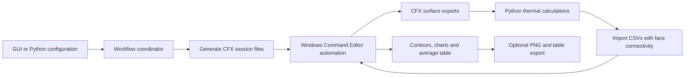

# CFX-Post-Automation-Toolkit

**Automate CFX-Post exports, thermal-comfort calculations, contours, histograms, and average tables through a Python desktop GUI.**

**First public release: v1.0.0** · Windows · Python 3.10+ · CFX-Post session target: 23.2

CFX-Post Automation Toolkit connects an already-open CFX-Post case to a repeatable post-processing workflow. Select locations, calculation settings, and visual outputs in a Tkinter wizard, or configure the same workflows through Python examples.

## Why this project exists

CFD post-processing often repeats the same work across many surfaces: export data, calculate comfort indicators, import the results, set contour ranges, and prepare figures and tables. This toolkit brings those steps into one configurable workflow so that location selections and plotting settings can be reused consistently.

## Key features

- Surface export and thermal-comfort CSV processing, with original face connectivity retained.
- PMV/PPD and operative temperature enabled by default; optional SET, UTCI, draft rate, clothing-surface calculations, and psychrometrics.
- Top-view and section contours, optional section velocity vectors, and separate velocity-streamline figures.
- Surface and volume histograms with shared per-variable bounds and divisions.
- One average table containing surface and/or volume averages.
- Custom CEL expressions exposed as CFX user scalar variables.
- Generated `.cse` files for export, import, figure creation, and printing; optional automatic PNG/table export.
- Progress messages in the GUI and callbacks for Python workflows.

## Choose an operating mode

| Mode | Use it when | What it does |
| --- | --- | --- |
| **Full automation** | You have a loaded CFX case and want comfort results plus visuals | Export surfaces → calculate comfort → import results → create selected visuals → optionally print |
| **Thermal comfort only** | You already have toolkit-compatible `export_*.csv` files | Recalculate CSVs and create an update-in-place import session; optionally execute it |
| **Figures / table / histograms only** | You want visuals from the loaded case without recalculating comfort | Resolve locations and temporary geometry → create visuals → optionally print directly into the selected folder |

Full automation and figures-only require CFX-Post to be open with the correct result loaded and its **Command Editor visible**. CSV-only calculations do not need an open CFX session, but the current calculation engine still imports Windows libraries.

## Requirements

- **Windows:** the runtime uses `pywin32` and Windows mouse, keyboard, clipboard, and window APIs.
- **Python 3.10 or later**, with Tkinter and pip. The declared minimum is not a tested matrix of every later Python version.
- An installed, usable **CFX-Post** for workflows that interact with CFX. Generated sessions specify **23.2**; compatibility with other versions is unverified.
- Python dependencies declared in [`pyproject.toml`](pyproject.toml): `numpy`, `pandas`, `scipy`, `pythermalcomfort==3.8.0`, `psychrolib`, and `pywin32` on Windows. The build backend uses `setuptools>=68` and `wheel`.
- For thermal calculations, surface data containing coordinates, Radiation Temperature, Relative Humidity Percentage, Temperature, Turbulence Kinetic Energy, and Velocity. See the [data format](docs/THERMAL_COMFORT.md#input-format).

CFX-Post, simulation cases, and commercial licenses are not included.

## Installation

Download and extract this repository, then open a terminal in the `CFX-Post-Automation-Toolkit` folder:

```powershell
py -m venv .venv
.\.venv\Scripts\python.exe -m pip install -e .
```

This installs the local package and its declared dependencies. The repository name is `CFX-Post-Automation-Toolkit`; the Python distribution is `cfxpost-toolkit`, and imports use `cfxpost_toolkit`.

**Prefer IDLE?** Open [`scripts/setup_environment.py`](scripts/setup_environment.py) with the Python installation you intend to use and press **F5**. It installs this checkout and its dependencies into that interpreter. Then open the root launcher in the same IDLE installation. See [installation details and troubleshooting](docs/INSTALLATION.md).

## Launch and quick start

```powershell
.\.venv\Scripts\python.exe CFX_Post_Toolkit_GUI.py
```

Alternatively, open `CFX_Post_Toolkit_GUI.py` in IDLE and press **F5** after installing dependencies in that interpreter.

1. Open your result in CFX-Post and show the **Command Editor**.
2. Launch the toolkit and select **Full automation**.
3. Choose a dedicated output folder and add the exact names of your existing CFX surfaces.
4. Review MET, clo, and calculation selections; PMV/PPD and operative temperature are enabled initially.
5. Select variables for the mandatory top-view contours. Add sections, histograms, or an average table as needed.
6. Review bounds and output settings. Enable the final printing checkbox if you want PNGs and table files immediately.
7. Run the workflow and review the progress window and output folder. Allow the toolkit to control the Command Editor while it runs.

Start with one surface and a small variable selection. No case files are bundled; the [examples](examples/README.md) explain both case-dependent scripts and a synthetic CSV-only demonstration.

## Detailed usage

The [user guide](docs/USAGE.md) walks through all three modes, location registries, import behavior, independent variable selections, printing, and custom expressions. The [examples guide](examples/README.md) provides small scripts for each mode plus a custom-variable example.

### Thermal-comfort calculations

The engine detects Kelvin/Celsius temperature headers, uses humidity exported as a percentage, floors air speed at the configured minimum, and calculates relative air speed and dynamic clothing insulation through `pythermalcomfort`.

| Calculation | Default | Implementation |
| --- | --- | --- |
| Relative air speed | Always | `v_relative`; dynamic clothing uses `clo_dynamic_ashrae` |
| PMV / PPD | On | `pmv_ppd_ashrae` |
| Operative temperature | On | Heat-transfer-weighted air/radiant temperature using the internal clothing model |
| SET | Off | `set_tmp` |
| UTCI | Off | `utci` using the supplied local velocity |
| Draft rate / turbulence intensity | Off | Explicit formulas using temperature, velocity, and TKE |
| Clothing-surface temperature / heat-transfer coefficients | Off as a standalone selection | Internal iterative model; also runs when operative temperature is enabled |
| Wet-bulb / dew-point temperature / humidity ratio | Off | PsychroLib in SI units |

Defaults are **1.7 met**, **0.57 clo**, minimum velocity **0.05 m/s**, pressure **101325 Pa**, emissivity **0.95**, and maximum nearest-neighbor cleaning distance **1 m**. Read [thermal-comfort methods and limitations](docs/THERMAL_COMFORT.md) before interpreting results; these calculations do not establish standards compliance.

### Visualization

- Top-view contours support native variables and calculated surface results in full automation.
- Section cameras are computed independently from exported geometry using PCA/SVD and a point-and-normal clipping plane. Section contours support native/created variables, optional velocity vectors, and velocity streamlines.
- Top-view and section velocity streamlines create separate figures and reuse Velocity bounds.
- Contour count defaults to **21**, histogram divisions to **20**, vector and streamline sample counts to **100**, and image size to **2400 × 1600**.
- Automatic bounds use common 5th/95th-percentile statistics. In figures-only mode, top-view and histogram variables require explicit lower/upper bounds; section bounds may remain automatic.
- Surface averages use `areaAve(...)`; volume averages use `volumeAve(...)`. Calculated thermal-comfort variables are excluded from volume averages.

### Custom CEL variables

In full or figures-only mode, enable an expression-derived variable such as:

```text
Name:       Temperature Difference
Expression: Temperature - 293.15[K]
```

The toolkit creates a distinct internal CEL expression and a `USER SCALAR VARIABLE`. The enabled variable becomes available in the visual selection panels. Expressions must be valid and dimensionally consistent in CFX; the toolkit does not evaluate CEL in Python. The locked `Relative Humidity Percentage = Relative Humidity*100` definition is displayed to visual users as **Relative Humidity**.

## Architecture and workflow



This shows full automation. Thermal-only begins with existing CSVs. Figures-only obtains temporary geometry and metadata from CFX and skips comfort calculation/import. Completion-marker files synchronize Python with CFX session execution.

```text
CFX-Post-Automation-Toolkit/
├── README.md                     # Start here
├── CFX_Post_Toolkit_GUI.py        # Desktop launcher
├── pyproject.toml                # Package metadata and dependencies
├── requirements.txt              # Dependency-only installation alternative
├── CHANGELOG.md                  # First public release notes
├── CONTRIBUTING.md               # Contribution and validation guidance
├── docs/                        # Detailed guides and screenshot placeholders
├── examples/                    # Small scripts and synthetic input data
├── scripts/setup_environment.py # IDLE-friendly installation helper
└── src/cfxpost_toolkit/          # GUI, configuration, workflows and engine
```

The [architecture guide](docs/ARCHITECTURE.md) maps source modules to their responsibilities.

## Outputs

Full automation organizes the chosen output directory as follows:

```text
your-run/
├── export/
│   ├── export_session.cse
│   ├── export_<surface>.csv
│   ├── visualization_metadata.txt
│   └── export_complete.txt
├── import/
│   ├── import_<surface>.csv
│   ├── import_session.cse
│   └── import_complete.txt
└── figures/
    ├── create_figures_session.cse
    ├── print_figures_session.cse
    ├── figures_creation_complete.txt
    ├── figures_printing_complete.txt  # After printing
    ├── *.png                         # After printing
    └── table_average_conditions.csv   # If table printing is selected
```

The table filename ends in `.csv`, but its generated CFX export settings use **tab-separated** fields. Marker files appear only after their corresponding CFX stages complete. A repaired input may also produce `export_<surface>_cleaned.csv` beside the source CSV.

Thermal-only uses the input and output folders selected by the user. Figures-only writes sessions, images, tables, and markers **directly into its selected folder**, without creating `export/`, `import/`, or `figures/` subfolders. Temporary visualization files are cleaned after session generation. Existing names can be overwritten; use a separate output folder for each run.

## Screenshots

Screenshots are not bundled yet. Add the following files under [`docs/images/`](docs/images/README.md), then embed the images here. Paths are intentionally shown as text until the files exist.

| Placeholder path | Suggested caption |
| --- | --- |
| `docs/images/01-mode-selection.png` | Choose full automation, thermal calculations, or visuals only |
| `docs/images/02-thermal-and-variables.png` | Configure comfort calculations and custom CEL variables |
| `docs/images/03-visual-selection.png` | Select surfaces, sections, variables, and contour ranges |
| `docs/images/04-histograms.png` | Configure surface and volume histograms |
| `docs/images/05-average-table.png` | Select surface and volume averages |
| `docs/images/06-cfx-result.png` | Example contour output in CFX-Post |

## Limitations and compatibility

- Generated session headers target **CFX-Post 23.2**. This release preparation did not include a live CFX-Post validation run; other versions are unverified.
- Automation drives the visible Windows Command Editor using its title, relative click positions, and clipboard. Window layout, scaling, localization, or competing mouse/keyboard activity can affect it.
- The toolkit does not launch CFX-Post, load result files, solve CFD cases, or create the source geometry/locations for you.
- Thermal CSVs must follow the expected CFX Generic surface format with `[Faces]`; arbitrary spreadsheets are not supported.
- Figures-only is intended for native/created variables. Built-in calculated comfort names such as `PMV` need import CSVs that this workflow does not supply; use full automation for those visuals.
- Engine configuration uses module-level state. Run one workflow at a time in a Python process.
- The toolkit produces images and tables, not a composed Word/PDF report. No standalone executable is provided.
- See [troubleshooting](docs/INSTALLATION.md#troubleshooting) and [calculation caveats](docs/THERMAL_COMFORT.md#interpretation-and-limitations).

## Version status and roadmap

**v1.0.0 is the first public release designation.** Earlier internal package/GUI numbering is not a public release sequence. See [CHANGELOG.md](CHANGELOG.md) for the packaging changes and [validation status](docs/VALIDATION.md) for checks performed.

Potential future work, not shipped capabilities or commitments:

- Establish a documented live CFX/Python compatibility matrix and reference-case checks.
- Add GUI screenshots and a distributable demonstration case with clear usage rights.
- Separate CSV calculations from Windows automation imports.
- Add saved/reloadable GUI configurations and more robust automation diagnostics.
- Expand numerical regression coverage and investigate packaged executable distribution.

## Contributing

See [CONTRIBUTING.md](CONTRIBUTING.md). Include reproducible inputs, versions, logs, and the generated session when reporting a problem. Remove private case data and personal paths before sharing.

## Author and license

**Author:** [Your name]  
**Profile/contact:** [Add your preferred profile or contact link]

No license was supplied with the source package, and this release preparation does not choose one on the author's behalf. Add an appropriate `LICENSE` before presenting the repository as open source.

## Disclaimer

This is an independent project and is **not affiliated with or endorsed by Ansys**. Ansys and its product names belong to their respective owners.
